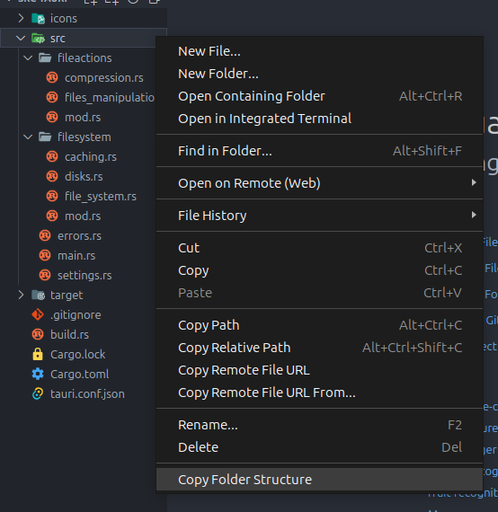

# VSC-Folder-Structure

This is a VS Code extension that allows you to copy a folder structure just by right clicking on it.

## Features



Once you click on the Copy Folder Structure, in the clipboard there is going to be the folder structure as a json object.

```
{
  "errors.rs": "File",
  "main.rs": "File",
  "settings.rs": "File",
  "fileactions": {
    "compression.rs": "File",
    "files_manipulation.rs": "File",
    "mod.rs": "File"
  },
  "filesystem": {
    "caching.rs": "File",
    "disks.rs": "File",
    "file_system.rs": "File",
    "mod.rs": "File"
  }
}
```

## Extension Settings

This extension contributes the following settings:

- `folder-structure.copyStructure.indentation`: The number of spaces to use for indentation.
- `folder-structure.copyStructure.type`: The type of the structure, both of which are shown above.

## Known Issues

Calling out known issues can help limit users opening duplicate issues against your extension.

## Release Notes

Users appreciate release notes as you update your extension.

### 1.0.0

Initial release of ...

### 1.0.1

Fixed issue #.

### 1.1.0

Added features X, Y, and Z.

---

## Following extension guidelines

Ensure that you've read through the extensions guidelines and follow the best practices for creating your extension.

- [Extension Guidelines](https://code.visualstudio.com/api/references/extension-guidelines)

## Working with Markdown

You can author your README using Visual Studio Code. Here are some useful editor keyboard shortcuts:

- Split the editor (`Cmd+\` on macOS or `Ctrl+\` on Windows and Linux).
- Toggle preview (`Shift+Cmd+V` on macOS or `Shift+Ctrl+V` on Windows and Linux).
- Press `Ctrl+Space` (Windows, Linux, macOS) to see a list of Markdown snippets.

## For more information

- [Visual Studio Code's Markdown Support](http://code.visualstudio.com/docs/languages/markdown)
- [Markdown Syntax Reference](https://help.github.com/articles/markdown-basics/)

**Enjoy!**

# VSC-Folder-Structure
